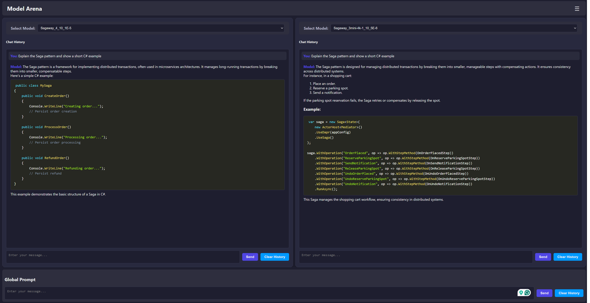

# Model Arena

**Model Arena** is a web-based tool designed to help you compare and interact with fine-tuned Large Language Models (LLMs) hosted on Azure AI Foundry. With a clean interface and powerful features, Model Arena simplifies the process of testing and evaluating AI models side-by-side.

## Features

### 1. Compare Models Side-by-Side
- Select and compare two different LLMs.
- Send prompts to both models and analyze their responses in parallel.

### 2. System Prompt Customization
- Configure a system prompt to guide the behavior of the AI models globally.
- Easily update the system prompt through an intuitive modal dialog.

### 3. Messaging Options
- **Global Messaging**: Send a single prompt to both models simultaneously.
- **Individual Messaging**: Interact with each model independently using dedicated input fields.

### 4. Chat History
- View the conversation history for each model in real-time.
- Supports Markdown for enhanced readability, including syntax highlighting for code snippets.

### 5. Azure AI Foundry Integration
- Easily connect your app settings file to Azure AI Foundry models.
- Securely store model connection details, including endpoint URLs and API keys.

## How to Use

### 1. Setting Up the Models
- Populate the `appsettings.json` file with your Azure AI Foundry model details in the following format:

```json
{
  "AzureAIModels": [
    {
      "Name": "Model_1",
      "Endpoint": "<Model_1_Endpoint>",
      "ApiKey": "<Model_1_ApiKey>"
    },
    {
      "Name": "Model_2",
      "Endpoint": "<Model_2_Endpoint>",
      "ApiKey": "<Model_2_ApiKey>"
    }
  ]
}
```

- Replace `<Model_1_Endpoint>`, `<Model_1_ApiKey>`, `<Model_2_Endpoint>`, and `<Model_2_ApiKey>` with your actual model details.

### 2. Launching the Application
- Start the application and open it in your browser.
- Use the dropdown menus to select the models you want to compare.

### 3. Sending Prompts
- Enter a prompt in the input field.
- Click the **Compare** button to send the prompt to both models.
- View the responses in the respective panels.

### 4. Customizing the System Prompt
- Open the **Set System Prompt** dialog from the menu.
- Modify the prompt and apply it globally to both models.

## Technologies Used

- **Blazor**: For building the interactive web interface.
- **Azure AI Foundry**: To host and manage the LLMs.
- **JavaScript Interop**: For seamless client-side interactions.
- **Markdown Rendering**: Powered by Markdig for advanced formatting.

## Getting Started

1. Clone the repository:
   ```bash
   git clone https://github.com/yourusername/model-arena.git
   ```

2. Navigate to the project directory:
   ```bash
   cd model-arena
   ```

3. Configure your Azure AI Foundry model details in `appsettings.json`.

4. Build and run the application:
   ```bash
   dotnet run
   ```

5. Open the application in your browser at `http://localhost:5000`.

## License

This project is licensed under the MIT License. See the [LICENSE](LICENSE) file for details.

## Contributing

Contributions are welcome! Please submit issues or pull requests to help improve Model Arena.

## Screenshots



## Contact

For questions or support, feel free to reach out to the project maintainer:
- **Name**: Alon Fliess
- **LinkedIn**: [Alon Fliess](https://www.linkedin.com/in/alon-fliess-36655)
